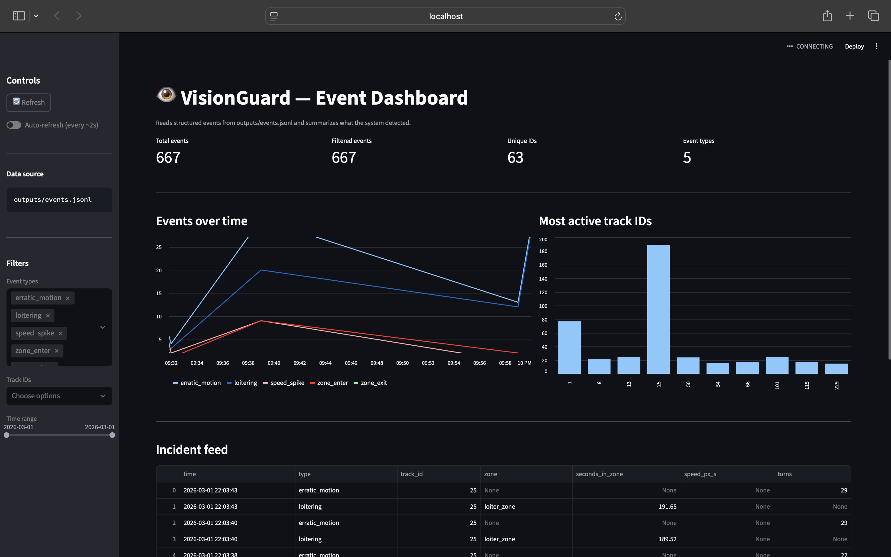

# VisionGuard — Real-Time Object Tracking & Behavior Analytics

VisionGuard is a real-time computer vision system that detects and tracks objects in video streams and generates behavior/anomaly events using motion trajectories.

## Demo

### Tracking + Events (OpenCV)


### Full System Demo (Video)
[Watch demo video](assets/demo.mp4)
## Tech Stack
Python, OpenCV, Ultralytics YOLOv8, ByteTrack, Streamlit, Pandas

## Features
- Real-time detection + multi-object tracking (persistent IDs)
- Zone entry/exit + loitering detection
- Speed spike + erratic motion detection
- Structured JSONL event logging (`outputs/events.jsonl`)
- Streamlit dashboard: incident feed, filters, charts, and session summary download

## Architecture
Video/Webcam → YOLOv8 Detection → ByteTrack Tracking → Motion Analytics → Event Log → Dashboard

## Run Locally

### 1) Install
```bash
python3 -m venv .venv
source .venv/bin/activate
pip install -r requirements.txt